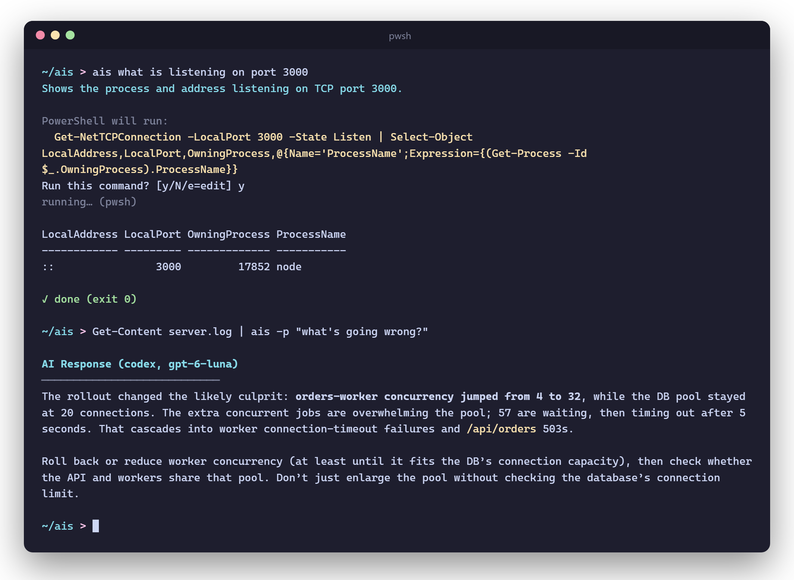

# ais

**Ask your terminal in plain English.** ais turns requests into shell commands
and runs them after you confirm, answers questions, and explains anything you
pipe into it.

<p align="center">
  
</p>

```sh
ais what is listening on port 3000          # → proposes a command, runs it on "y"
ais which files in this repo change the most
ais undo my last commit but keep the changes
ais how do I split windows in nvim          # → just answers

git diff | ais -p "any bugs in this change?"
npm test 2>&1 | ais -p "why is this failing?"
```

## Install

```sh
# Linux / macOS
curl -fsSL https://raw.githubusercontent.com/sqmch/ais/main/scripts/install.sh | sh
```

```powershell
# Windows
irm https://raw.githubusercontent.com/sqmch/ais/main/scripts/install.ps1 | iex
```

A single binary with no runtime. Re-run the installer to update; swap in
`uninstall.sh` / `uninstall.ps1` to remove it. ais uses your
[Codex CLI](https://github.com/openai/codex) login, so run `codex login` once.

## How it works

- **Run or answer:** ais decides for you. Anything about your machine
  ("is nginx running?") becomes a command; general questions get an answer.
- **You stay in control:** every command is shown first, flagged if it changes
  state or is destructive. `y` runs it, `e` edits it, anything else skips.
- **Failures get a second look:** if a command fails, ais offers to send the
  error back to the model and propose a fix.
- **Runs in your shell** (PowerShell on Windows, `$SHELL` elsewhere) with your
  terminal attached, so prompts like `sudo` work.

## Models

ais defaults to `gpt-6-luna` with low reasoning, which is fast and cheap and
plenty for one-line commands.

```sh
ais --list-models             # models your account can use
ais --configure               # pick a default (saved to ~/.config/ais/config.json)
ais -m gpt-6-sol -r medium …  # one-off override
```

ais never touches your Codex setup: it calls Codex with per-run flags only, stays
out of your session history, and skips your plugins and MCP servers, which also
keeps it fast.

## Flags

| Flag | |
| --- | --- |
| `-p, --prompt` | Prompt to go with piped input |
| `-a, --agent` | Always turn the request into a command |
| `-y, --yes` | Run without confirming |
| `-n, --dry-run` | Show the command, don't run it |
| `-m, --model` / `-r, --reasoning` | Model and reasoning effort for this run |
| `-b, --backend` | `auto` · `codex` · `api` (`OPENAI_API_KEY`) · `oss` (Ollama / LM Studio via `--local-provider`) |
| `--configure` / `--list-models` | Pick defaults / list models |

## Build

```sh
go build -o ais ./cmd/ais && go test ./...
```
